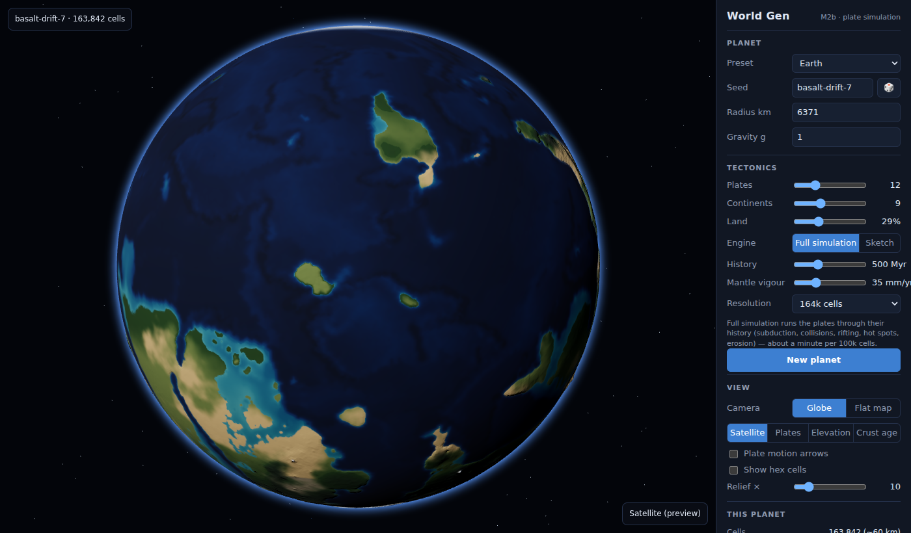
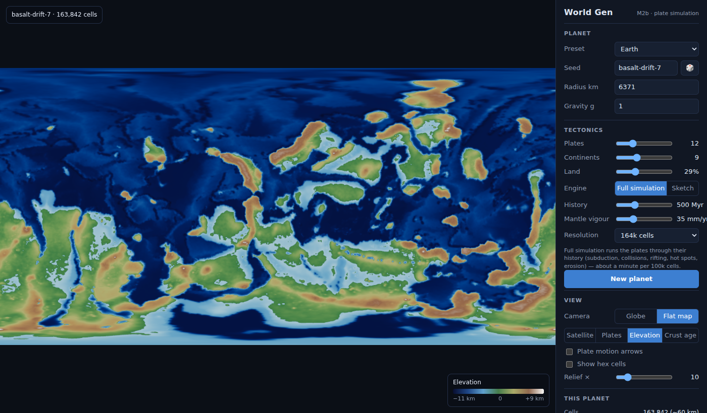
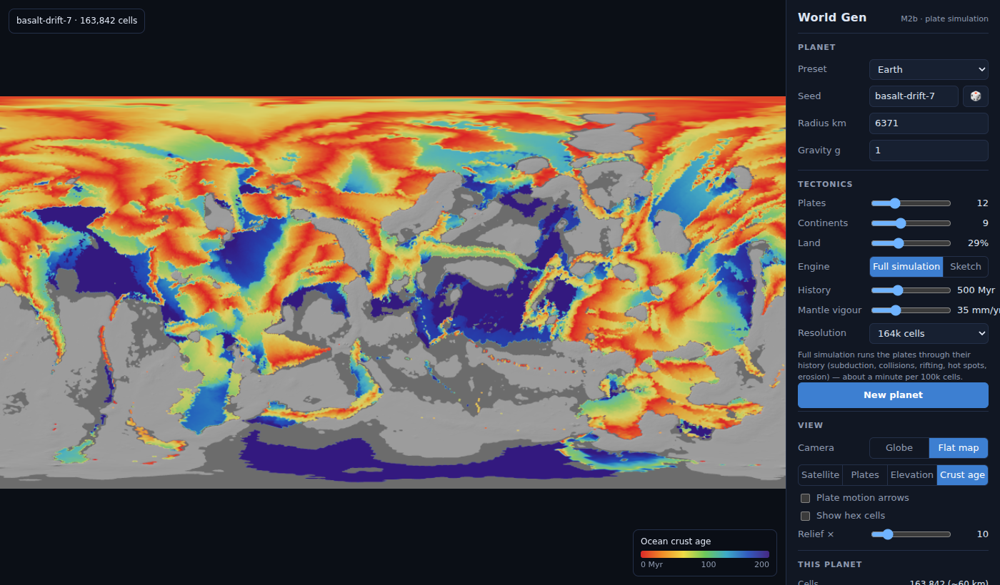

# God Game — World Gen

A procedural planet generator that runs in the browser: plate tectonics, a
height map, and (soon) climate and rivers on a hex-tiled sphere, shown as a
3D globe or a flat map. It's the world layer for a god game to come.



| Elevation | Ocean crust age |
| --- | --- |
|  |  |

## Run it

```bash
npm install
npm run dev          # http://localhost:5173
npm test             # unit tests
npm run bench        # timing for every preset × resolution
npm run build        # static site in dist/
npm run build:single # everything in one HTML file (dist-single/index.html)
npm run engine       # rebuild the Rust tectonics engine → src/engine/tecto-wasm.ts
npm run score -- 4 --freq 64   # scorecard over several seeds per preset
```

Desktop browser with WebGL2 required. The compiled engine is committed
(base64 in `src/engine/tecto-wasm.ts`), so Rust is only needed to change it:
`rustup target add wasm32-unknown-unknown`, then `npm run engine`.

## What's in M2b — the plate simulation

The world is now made by running the plates through their history
(default 500 Myr) in a Rust engine compiled to WebAssembly (`engine/`):

- **Rigid plates in their own frames.** Each plate stores its crust
  (thickness, age, type, orogeny history) on the hex grid in its own
  rotating frame; moving a plate is only a rotation, so coastlines and
  mountain belts are carried exactly, never re-interpolated.
- **Subduction and collision.** Where plates overlap, ocean goes under
  anything (the older slab sinks), continents never subduct; colliding
  continents stack their crust onto the upper plate (crust is conserved)
  and eventually suture into one plate.
- **Sea-floor spreading.** Gaps between diverging plates fill with new
  ocean crust at the real opening rate, so crust ages form ridge-parallel
  stripes and ocean depth follows age.
- **Mountain building.** Cordilleras grow above slabs (mostly shortening
  that thins the back-arc, plus arc magmatism), island arcs grow into new
  continental crust, the forearc is eroded away, rifts thin their margins,
  hot spots build island chains and plume-head plateaus.
- **Isostasy, flow and erosion.** Elevation floats on crust thickness;
  thick crust spreads under its own weight (plateaus flatten); relief-driven
  erosion moves rock downhill into basins and onto shelves.
- **Plate motions from forces.** Slab pull, gravitational sliding (ridge
  push), collision resistance and drag from a slowly changing mantle flow,
  balanced against basal drag and scaled to the mantle's vigour.
- **Plate reorganisation.** Continents rift (big ones more often), old
  ocean breaks away at passive margins and starts subducting, slivers are
  absorbed.

It takes about 1.5 minutes for the default 164k-cell Earth. The M1 snapshot
engine stays available as a quick sketch.

## What's in M1

- **Hex-sphere grid** — Goldberg polyhedron (dual of a subdivided
  icosahedron), 10k → 655k cells. 12 pentagons, the rest hexagons.
- **Snapshot tectonics** — plates grown by weighted flood fill, each rotating
  about its own Euler pole; boundaries classified convergent / divergent /
  transform from the relative motion across them. Continents are placed
  independently of plates, so plates carry both kinds of crust.
- **Height pass** — ocean depth from crust age (WorldSmith table),
  WorldSmith-style mountain cross-sections by landform type (Andean
  cordillera, collision plateau + foreland, island arc, trench, rift, old
  ranges), relief scaled by 1/g (capped ×3), sea level solved so land covers
  the target fraction.
- **Views** — globe (displacement + bump lighting + atmosphere) and a
  wrap-around flat map, both from one 4096×2048 texture. Map modes:
  satellite (preview), plates, elevation, crust age. Plate-motion arrows,
  hex-cell toggle, relief slider, hover info, PNG export, shareable links.
- **Presets** — Earth, Mars-size, Moon-size and custom. All parameters are in
  real units (km, Myr, m, mm/yr), so every preset runs the same code.

## Layout

```
src/
  core/      rng, noise, presets, heap, half floats
  grid/      hex grid, point→cell locator, texture sampler, distance fields
  sim/
    tectonics/snapshot.ts   M1 plates (quick sketch; starting state for the drift sim)
    tectonics/drift.ts      runs the Rust engine and finishes the height map
    terrain/elevation.ts    height pass
    generate.ts             pipeline
    engine.ts, worldgen.worker.ts, client.ts, protocol.ts
  render/    three.js view, texture baking, colour maps, arrows
  ui/        control panel, styles
  engine/    wasm bridge + embedded engine binary
engine/      Rust plate-tectonics engine (grid, plates, sim, C ABI)
tests/       vitest
scripts/     bench, headless screenshots
```

Generation runs in a Web Worker. The worker keeps the world and a
precomputed texel → triangle map, so switching map modes only re-bakes the
texture (~100 ms). If workers are blocked it falls back to the main thread.

## Roadmap

| Milestone | Scope |
| --- | --- |
| **M1 ✓** | Grid, snapshot plates, height pass, globe + map, panel |
| **M2a ✓** | Planet scorecard: plausibility bands (Earth as reference, not target) |
| **M2b ✓** | Rust plate simulation: forces, subduction, collision, rifting, hot spots, isostasy, erosion |
| M2c | Stream-power erosion (Fastscape-style) for valley-scale relief; faster high-res runs |
| M3 | Monthly climate (insolation, circulation cells, currents, rain shadows) and exact Köppen zones |
| M4 | Rivers (priority-flood, major basins only), real satellite colours, presets polish |

## Sources

- Artifexian, *The WorldSmith 8.00* — ocean depth table, mountain profiles, peak height vs gravity
- Cortial et al., *Procedural Tectonic Planets* (2019) — the M2 drift model
- Viitanen, *Physically Based Terrain Generation* (PlaTec, 2012) — plate-frame crust, collision/merge rules
- Forsyth & Uyeda (1975), Conrad & Lithgow-Bertelloni (2002) — plate driving forces
- Reymer & Schubert (1984) — arc crust growth rates; Ahnert (1970) — denudation vs relief
- Worldbuilding Pasta, *An Apple Pie from Scratch* — tectonics and climate rules
- Andy Gainey, *Procedural Planet Generation* — hex sphere and plate boundaries
- Red Blob Games — sphere map generation, mapgen4
